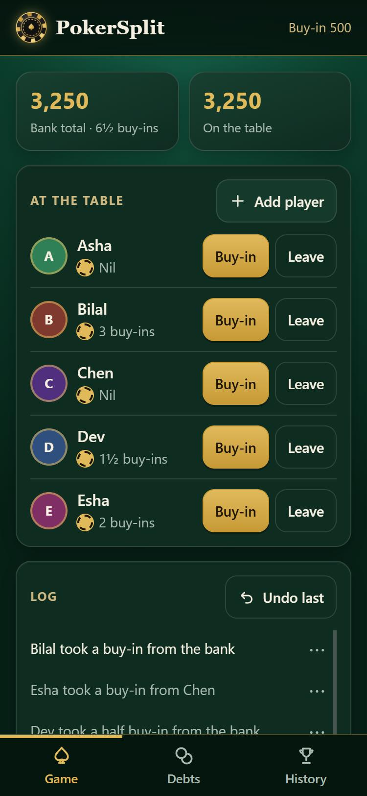
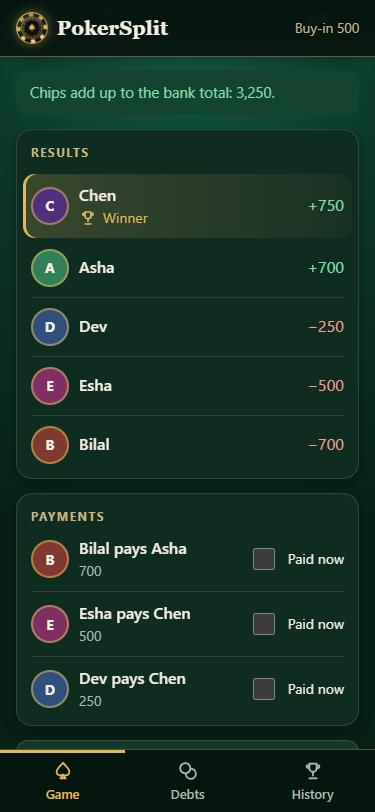
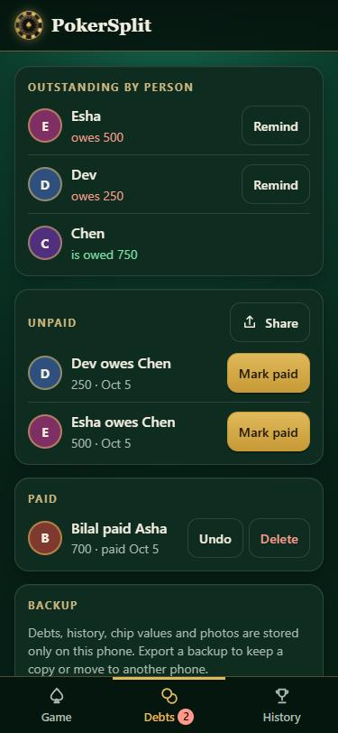

# PokerSplit

A phone app for home poker nights. It keeps track of who bought in, works out who owes whom in the fewest possible payments, and remembers the debts nobody paid on the night.

**Try it: [pokersplit-rose.vercel.app](https://pokersplit-rose.vercel.app)**

Open the link on your phone and add it to the home screen (Android: "Install app"; iPhone: Share → "Add to Home Screen"). After that it opens like any other app and works with no signal.

<p>
  
  
  
</p>

## What it does

**During the game**

- Records buy-ins from the bank or from another player's stack, as a full buy-in, a half, or any custom amount.
- Shows each player's running count. Giving buy-ins away can take a player to nil or below, which the app marks as locked-in profit.
- Players can join mid-game, leave with their chips, and come back later.
- Every action goes into a log. Any entry can be deleted, and the chips on a leave can be corrected; the app refuses a change that would make the history impossible (for example, removing a player who later gave someone a buy-in).

**Settling up**

- Enter everyone's final chips and the app checks they add up to what the bank handed out, so miscounts are caught before money moves.
- It then lists each player's profit or loss and the smallest set of payments that squares the table.
- The result can be shared as text to any chat app.

**Debts**

- Payments not made on the night are kept as debts, in separate unpaid and paid lists, across as many games as you play.
- Supports part payments, a per-person outstanding total, and a reminder message for whoever owes.
- "Simplify" nets all unpaid debts across nights into the fewest payments, so opposite debts between the same people cancel out.

**History and leaderboard**

- Every finished night is saved with its results, payments and log.
- A leaderboard shows each player's running total, best night and worst night.

**Chip tools**

- Chip counter: enter how many chips of each colour a player has and it totals the stack.
- Chip splitter: enter your chip set and the number of players, and it deals every player a starting stack worth exactly one buy-in, spread as evenly across the colours as the set allows.

**Live link**

- The scorer can create a link that lets the other players watch the table update on their own phones. Viewers can't change anything.

**Also**

- Player avatars, with an optional photo per player.
- Backup export and import, for moving to a new phone.

## How a game works

The app follows a common home-game convention, which differs a little from a casino cash game:

- One buy-in amount is fixed for the night.
- Everyone who starts the game takes their first buy-in from the bank.
- Later buy-ins come from the bank **or from another player**, who hands over chips from their own stack.
- A player-to-player buy-in is minus one for the giver and plus one for the taker; the bank total doesn't change.
- No money changes hands during the game. The bank is only a record.
- At the end, each player's result is their final chips minus what they are in for, and players pay each other directly.

## How the settlement works

Suppose the night ends like this:

| Player | Result |
|---|---|
| Chen | +750 |
| Asha | +700 |
| Dev | −250 |
| Esha | −500 |
| Bilal | −700 |

The obvious approach, matching the biggest loser with the biggest winner until everyone is square, takes four payments here. PokerSplit finds three:

- Bilal pays Asha 700
- Esha pays Chen 500
- Dev pays Chen 250

The idea: if a group of players' results add up to exactly zero, that group can settle among themselves, and a group of `k` players never needs more than `k − 1` payments. So the fewest payments overall comes from splitting the table into as **many** zero-sum groups as possible. Above, {Bilal, Asha} and {Chen, Dev, Esha} are two such groups, giving 1 + 2 = 3 payments instead of 4.

Finding the best split is done with a search over all subsets of players (a bitmask dynamic programme in [`logic.js`](logic.js)). It is exact for up to 16 players with a non-zero result, which covers any home game; beyond that it falls back to the simple pairing.

## How it's built

- Plain HTML, CSS and JavaScript. No framework, no build step, no dependencies.
- A progressive web app: a service worker caches the files so it opens offline, and a manifest makes it installable.
- All data (the current game, debts, history, chip values, photos) is stored on the scorer's phone in `localStorage`.
- The live link is the only part that uses a server: a Firebase Realtime Database, called directly over its REST interface.
- The game is stored as an event log (join, bank buy-in, transfer, leave) and everything on screen is derived by replaying it. That is what makes undo and log editing straightforward.

| File | Purpose |
|---|---|
| [`logic.js`](logic.js) | Pure game logic: replaying the log, validating edits, settlement, debt netting, chip splitting, leaderboard. No DOM or storage, so it is tested on its own. |
| [`store.js`](store.js) | Reading and writing `localStorage`, and backup export/import with validation. |
| [`app.js`](app.js) | All screens, sheets and event handling. |
| [`live.js`](live.js) | Publishing and watching the live view. |
| [`config.js`](config.js) | The database address for the live link. |
| [`sw.js`](sw.js) | Service worker for offline use. |
| [`firebase-rules.json`](firebase-rules.json) | Security rules for the live-view database. |
| [`tests/logic.test.js`](tests/logic.test.js) | Tests for everything in `logic.js`. |
| [`PLAN.md`](PLAN.md) | The full spec: rules, data model, screen behaviour and the manual test script. |

## Running it locally

You need Python (for a local web server) and, for the tests, Node.js.

```bash
python -m http.server 8123
```

Then open <http://localhost:8123>. It has to be served over http rather than opened as a file, or the service worker won't register.

Run the tests with:

```bash
node tests/logic.test.js
```

## Hosting your own copy

The app is static files, so any static host works (this one is on Vercel with no build command). Each copy keeps its own data, tied to its web address.

The live link needs a database of your own:

1. Create a Firebase project and add a **Realtime Database**.
2. Paste [`firebase-rules.json`](firebase-rules.json) into the database's Rules tab and publish it.
3. Put the database URL in `firebaseUrl` in [`config.js`](config.js). Leave it empty to switch the live link off; the rest of the app is unaffected.
4. Bump the `CACHE` version in [`sw.js`](sw.js) whenever you change a shipped file, so installed copies pick up the update.

How the rules protect a game: each game is stored under a random, unguessable id, and only its displayed state can be read. Every update must carry a one-time code and a signature made from a key that never leaves the scorer's phone, so someone who has the link can watch but can't alter the game. There is no sign-in, which means anyone who knows the database address could create new junk entries, though not read or change a real game.

## Privacy

- Games, debts, history and photos stay on the scorer's phone. There are no accounts.
- If the scorer creates a live link, the names and amounts in that game are visible to anyone who has the link. Photos are never sent.

## Limits

- One phone keeps score. Data isn't synced between phones; use backup export and import to move it.
- Debts and history are matched by player name, so the same person under two spellings counts as two people.
- Clearing the browser's site data, or uninstalling the app, deletes its data. Export a backup first.
